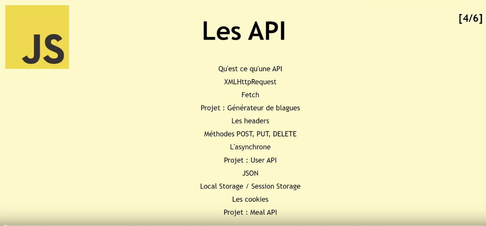

# meal-app

# [Cours Javascript] Apprendre Javascript de A à Z – La POO (5/6)

## From Scratch - Développement Web

( [VIDEO](https://youtu.be/Z3hrfLcr2Ws) )

**Timecodes**

- [x] 0:00 - Intro
- [x] 3:08 - Rappels des Objets en JS
- [x] 18:08 - Les méthodes des objets
- [x] 27:30 - Les différents constructeurs d'objets
- [x] 38:20 - Les prototypes
- [x] 49:28 - L'héritage
- [x] 55:20 - Yoga App

